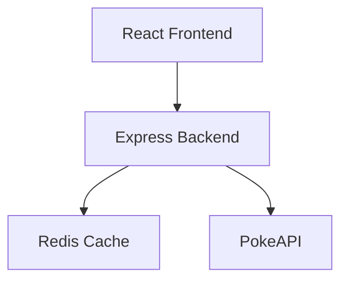

# 📱 Pokémon Pokedex Search Engine — Enterprise Full-Stack Application

[](https://www.typescriptlang.org/)
[](https://react.dev/)
[](https://expressjs.com/)
[](https://redis.io/)
[](https://tailwindcss.com/)
[](https://www.docker.com/)

A modern, high-performance, recruiter-impressive, and production-grade full-stack **Pokémon Pokedex Search Engine**. The application features an Express.js backend with two layers of caching (Redis or local in-memory LRU) and a stunning, responsive glassmorphic React 19 single-page app (SPA).

---

## 🗺️ Architectural Topology

The application divides workflows into dedicated backend microservices and static asset routers, optimizing request lifecycles:



## ⚡ Enterprise Features Checklist

### 💻 Frontend Layer (React 19 SPA)
* **Recruiter-Grade Glassmorphism UI**: Beautiful theme layouts tailored dynamically to each Pokémon's primary type (e.g. glowing orange for Charizard, pink for Clefairy).
* **Autocomplete & Search Suggestion Engine**: Debounced key triggers with direct dropdown navigation mappings and history tracking.
* **Full Detail Panel**:
  * Dual-sprite presentation with interactive **View Shiny** toggle.
  * Real-time audio player pulling official ogg entries for **Pokémon Cries**.
  * Dynamic **Type Effectiveness HUD** showcasing weaknesses (2x/4x), resistances (0.5x), and immunities (0x) with color-coded badges.
  * Stats comparison sheets highlighting stat winners with active trophies.
  * Ability detail grids, gender rate gauges, species origins, color indicators, and egg groupings.
* **WAI-ARIA & Accessibility Support**: Enriched inputs with correct accessible attributes (`role="combobox"`, `role="listbox"`, `role="option"`, and explicit `aria-expanded` and `aria-label` screen reader tags).
* **Graceful Loading & Error Recovery**: Integrated central React `ErrorBoundary` ("A Wild Error Appeared!" retro hud) and beautiful skeleton loading states.

### ⚙️ Backend Layer (Express.js & TypeScript)
* **Scalable Cache Management**: Checks for Redis container links dynamically, falling back automatically to an in-memory **LRU cache** (`lru-cache`) with custom TTL and entry constraints.
* **Centralized Logger & Security**: Includes customized `winston` logs, strict CORS validation, express rate-limit protection, request compression, and Helmet protection.
* **Centralized Error Handler**: Captures axios errors and wraps them in clean JSON envelope structures (`{ success: false, error: { code, message } }`).
* **Swagger Documentation**: Self-documenting paths exposed on `/api-docs` using interactive UI grids.

---

## 📂 Project Structure

```bash
├── backend/                  # Express.js REST API
│   ├── src/
│   │   ├── cache/            # Caching manager (Redis + in-memory LRU fallback)
│   │   ├── config/           # App configuration & Swagger UI setup
│   │   ├── controllers/      # Route controllers
│   │   ├── middleware/       # Logger, Rate Limiter, Error handlers
│   │   ├── routes/           # REST endpoints definition
│   │   ├── services/         # PokéAPI integration and transformers
│   │   ├── types/            # Strict TypeScript interfaces
│   │   └── utils/            # Winston logger, retry routines, helpers
│   ├── Dockerfile            # Multi-stage production container setup
│   └── package.json
│
├── frontend/                 # React 19 Single Page App
│   ├── public/               # Static assets & Pokeball custom fallback vector
│   ├── src/
│   │   ├── components/       # Layouts, UI buttons, SearchBar, PokemonCard
│   │   ├── constants/        # Pokémon type color tokens
│   │   ├── hooks/            # LocalStorage handlers, Query bindings
│   │   ├── pages/            # Home, Details, Favorites, Compare, NotFound
│   │   ├── services/         # Axios client instances
│   │   ├── types/            # Domain and payload types
│   │   └── utils/            # Type-effectiveness, formatting, layout helpers
│   ├── Dockerfile            # Two-stage builder compiling Nginx deployment
│   ├── nginx.conf            # Custom static assets rewrite mapping rules
│   └── package.json
│
├── docker-compose.yml        # Orchestrates Redis, Express, and Nginx portal
├── package.json              # Root orchestration and scripts setup
└── README.md                 # This documentation
```

---

## 🛠️ Unified Installation & Setup

You can run this application locally using standard development tools or inside isolated Docker containers.

### Method A: Local Developer Setup (No Docker)

#### Prerequisites
- Node.js (v18 or higher)
- Redis Server (Optional, local instance)

#### Step 1: Install Dependencies
From the repository root, run the unified installer:
```bash
npm run install:all
```
This single command installs the required dependencies in the root, `/backend`, and `/frontend` folders concurrently.

#### Step 2: Configure Environments
Create a `.env` file inside `/backend` following `/backend/.env.example`. Standard settings are preconfigured:
```env
PORT=3000
NODE_ENV=development
CORS_ORIGIN=http://localhost:5173
```
Create a `.env` file inside `/frontend` matching:
```env
VITE_API_BASE_URL=http://localhost:3000/api
```

#### Step 3: Run the Dev Server
From the root folder, launch both servers in parallel:
```bash
npm run dev
```
* **Frontend Web App**: [http://localhost:5173](http://localhost:5173) (Vite Dev Server)
* **Backend REST Service**: [http://localhost:3000](http://localhost:3000)

---

### Method B: Unified Docker Compose (Recommended)

To run the entire stack inside isolated, production-grade microservices with a single command:

#### Step 1: Build and Launch
From the root folder containing `docker-compose.yml`, execute:
```bash
npm run docker:up
```

#### Step 2: Access the Application
* **Frontend SPA portal**: [http://localhost:80](http://localhost:80) (Served through Nginx)
* **Backend Express API**: [http://localhost:3000](http://localhost:3000)
* **Swagger Interactive Docs**: [http://localhost:3000/api-docs](http://localhost:3000/api-docs)

To shut down and prune containers:
```bash
npm run docker:down
```

---

## 🛰️ REST API Documentation

All request responses follow a standardized JSON envelope structure:
```json
{
  "success": true,
  "data": { ... },
  "meta": {
    "requestId": "d8e3b1c5-2342-4f10-9831-2947a1cd1f54",
    "timestamp": "2026-05-20T11:06:07Z",
    "duration": 42,
    "cached": true,
    "cacheSource": "redis"
  }
}
```

### Endpoints Detail

#### 1. Get Pokémon Profile
* **Route**: `GET /api/pokemon/:nameOrId`
* **Description**: Returns deep specs for a single Pokémon name or database index.
* **Success Payload Example**:
  ```json
  {
    "success": true,
    "data": {
      "id": 25,
      "name": "pikachu",
      "height": 4,
      "weight": 60,
      "types": ["electric"],
      "abilities": [
        { "name": "static", "isHidden": false, "slot": 1 },
        { "name": "lightning-rod", "isHidden": true, "slot": 3 }
      ],
      "stats": [
        { "name": "hp", "baseStat": 35, "effort": 0 },
        { "name": "attack", "baseStat": 55, "effort": 0 }
      ],
      "sprites": {
        "frontDefault": "...",
        "officialArtwork": "..."
      },
      "description": "When several of these POKéMON gather, their electricity could build and cause lightning storms."
    }
  }
  ```

#### 2. Search Autocomplete
* **Route**: `GET /api/pokemon/search?q=:query&page=:page&limit=:limit`
* **Description**: Performs a partial matching search query on name indexes.
* **Query Parameters**:
  * `q` (string): The partial query string (e.g. `pika`)
  * `page` (number): Default: `1`
  * `limit` (number): Default: `20`

#### 3. Fetch Random Profile
* **Route**: `GET /api/pokemon/random`
* **Description**: Selects a randomized Pokémon species from the database pool and pulls its details.

#### 4. Stat Comparison
* **Route**: `GET /api/pokemon/compare?names=charizard,blastoise`
* **Description**: Compares statistics and type charts for 2-4 Pokémon side-by-side, returning direct stat winners.

#### 5. Health Check
* **Route**: `GET /api/health`
* **Description**: Monitors system performance, uptime, system load, memory logs, and Redis status.

---

## 📷 Screenshots Section Placeholders

### 🏡 Glassmorphic Landing Page & Auto-suggestions
> *Placeholder: Elegant Homepage visual showing glassmorphic text input and interactive results suggestions dropdown.*

### 📊 Detail Dashboard & Type Multipliers Card
> *Placeholder: Screenshot showing PokemonDetailPage with colored type-matched headers, animated stat progress bars, and the compounding weaknesses matrix panel.*

### ⚖️ Side-by-Side Stat Evaluator
> *Placeholder: Visual of the stat comparison table mapping Charizard vs Blastoise, marking stat-winners with trophy graphics.*

---

## 👨‍💻 Enterprise Quality Assurance & Coding Best Practices

1. **Strict Type Checking Enabled**: Compiled with `"strict": true` and `"verbatimModuleSyntax": true` to force precise ESM module imports and guarantee zero runtime typing leaks.
2. **Caching Resiliency**: Implemented dual-layer cache fallback (in-memory LRU as a fallback for Redis database connection dropouts).
3. **Advanced Micro-animations**: Leveraged custom spring configurations in Framer Motion for premium user interfaces.
4. **WAI-ARIA Compliance**: Complete input descriptions and active roles map onto the search components.
